## **Background**

Joe's discovered the fascinating world of digital tokens and he's looking to build different smart contract applications that will enable him do a number of things:

 - Mint his most memorable pictures onto a blokchain as NFTs.
 - Mint his own art while astutely coding and using his own fungible token to do so and; 
 - Lastly create a dutch auction mechanism to try and sell his NFTs to other blockchain participants!
 
         
  

## **High Level Goals** 
- To showcase to beginner/intermediary smart contract developers the versatility of token contracts.

- To connect ERC20 & ERC721 tokens.

- To show a mechanism that can be used in selling NFTs on a blokchain by using smart contracts

## **Technologies**

### Blockchain related
- **Solidity**: Programming language used to write smart contracts. 
- **Remix**: IDE used to write smart contracts in Solidity. It contains functionality that enables a user to compile and deploy contracts outside of a blockchain. 
- **MetaMask**: Browser extension of cryptocurrency wallet used to connect and deploy contracts & transactions on a blockchain.
- **(Polygon) Testnet**: Testnets allows developers to deploy contracts and transact in a blokchain without incurring gas fees. It is a simulation of a real blokchain which is perfect for developmental puporses  
- **Pinata**:  Pinata's powerful but easy-to-use product allows users to upload, share, and manage files with unmatched speed throughout the IPFS network. 
- **IPFS**: The InterPlanetary File System is a protocol and peer-to-peer network for storing and sharing data in a distributed file system. 
- **Web3.py:** is a Python library for interacting with Ethereum.

### Other
- **Python**: Programming language used to develop the back end of our ""Photo Registry"" UI. 
- **Streamlit**: Python package used to develop a UI web application. 

## **Snapshots of our code**

We compiled a few images of back end code and blockchain transaction history we collected along the way. 

We strongly suggest you check our video demo presentations for a complete overview of our work!

*Videos can be found on the presentation slides.

### **Part I: Register Photography**
We created an easy to use UI that allows any person to mint digital images as NFTs. These NFTs were not minted into a blockchain but were only ran locally.

*Deployment of NFT contract on Remix IDE* 

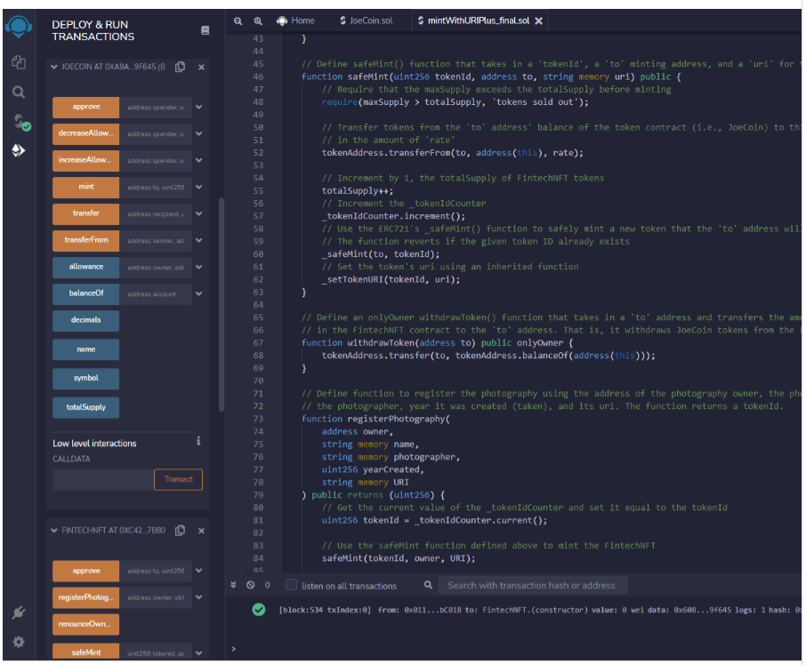

*Deployment of Coin token contract on Remix IDE*

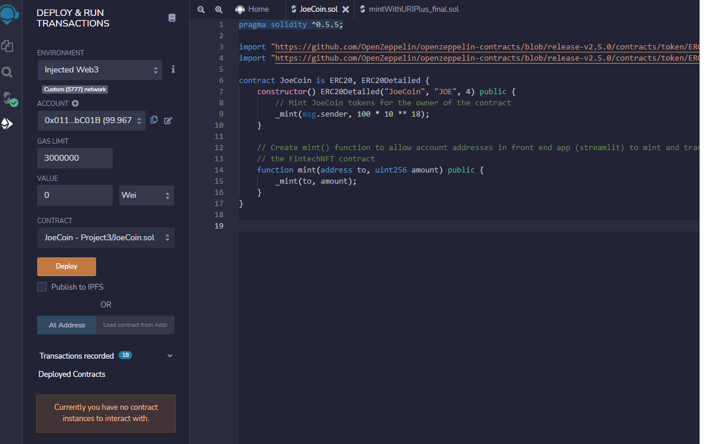

*Excerpts from our python/streamlit code behind our web based UI*

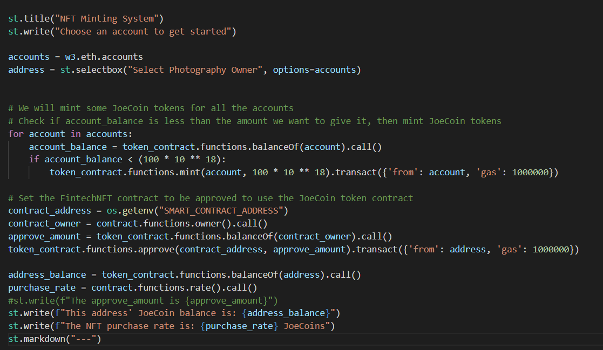

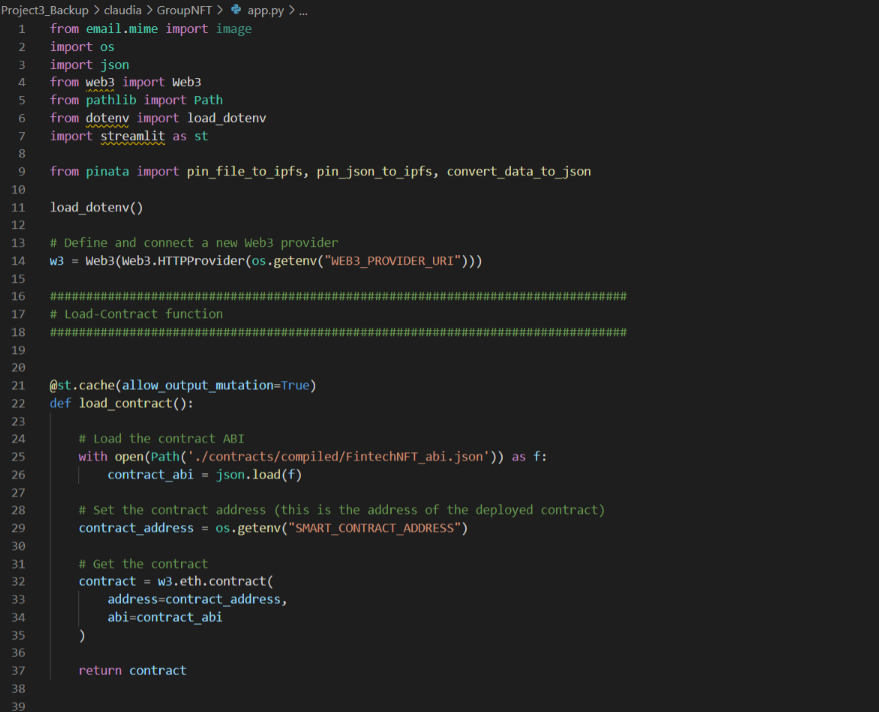

*loading our token contract (python function)*

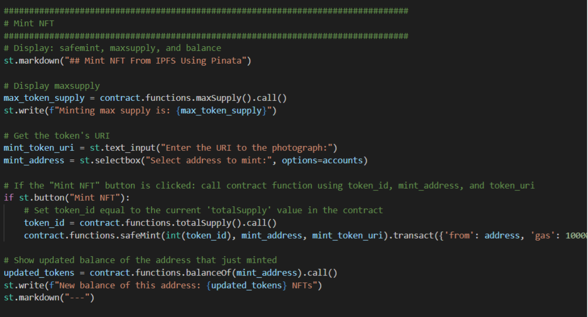

### **Part II: Minting on the blockchain**
We used an ERC20 contract to create our own fungible token. Then we added functionality to a ERC721 contract to accept our fungible token as payment in order to mint NFTs.   

We minted our tokens to Polygon's testnet and showcased our NFT on Opensea.

*Snapshot of JoeToken deployed on Polygon*

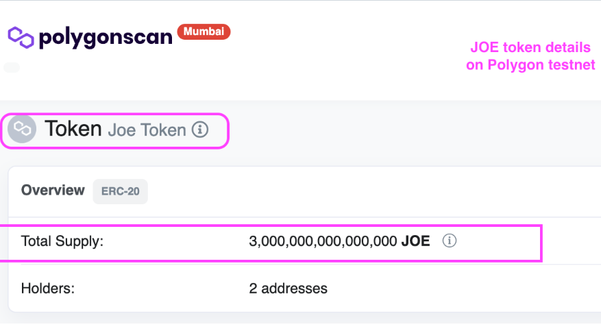

*Initializing JoeToken contract address as a state variable on our NFT contract before deploying*

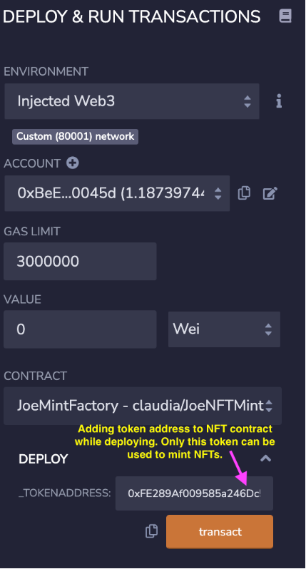

*Polygon transaction record*

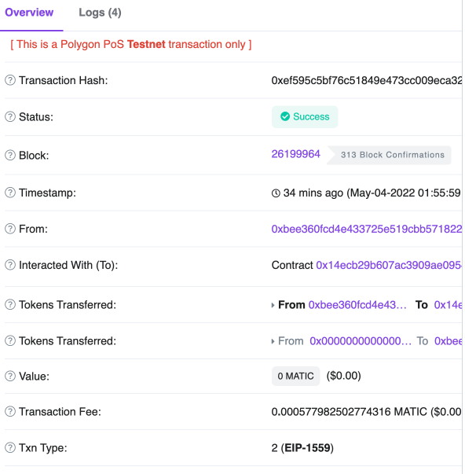

### **Part III: Deutch Auction**
We built a smart contract that simulates a dutch auction in order to sell NFTs on a blockchain.

*Ductch Auction Contract*

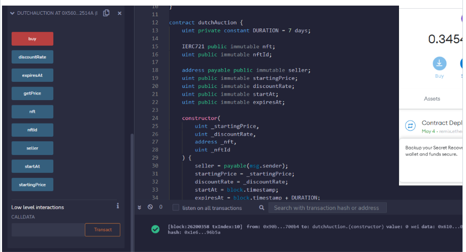

*NFT contract*

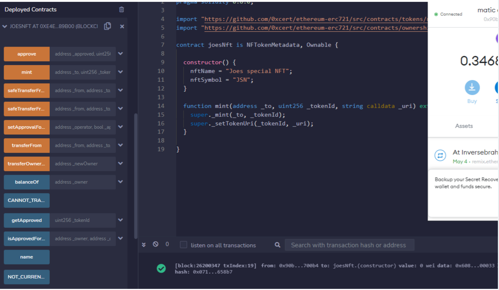

*Functionality embedded on NFT contract*

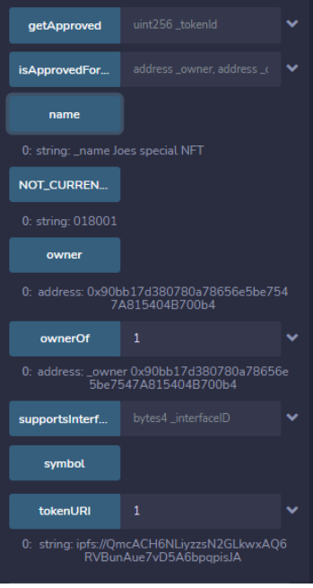

## **Conclusions**
Using readily available and open-source blockchain technologies and fairly advanced but easy to read Solidity (and Python!) code, we were able to successfully develop standard-meeting tokens and use them in different contexts. From creating a registry of tokenized pictures, to deploying tokens on an actual blockchain, to formulating a way to sell them!